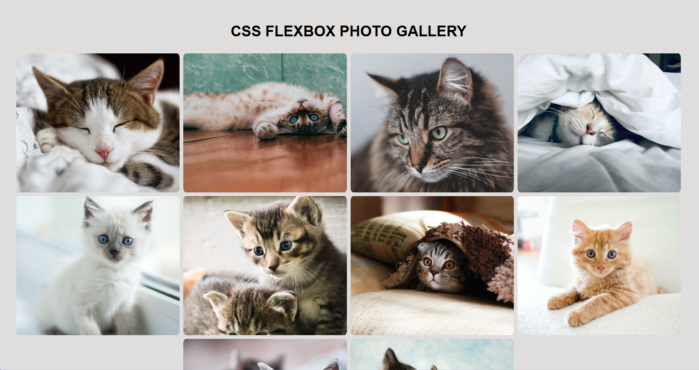

# 📸 Photo Gallery
A responsive, accessible, and minimalist Photo Gallery Web App, built as part of the freeCodeCamp Responsive Web Design certification. This project showcases a flexible layout, semantic HTML structure, and clean CSS styling, optimized for modern browsers and devices.



## 🚀 Live Demo
[https://razeen-shaikh.github.io/photo-gallery/](https://razeen-shaikh.github.io/photo-gallery/)

## 📂 Project Structure

```bash
photo-gallery-project/
│
├── index.html
├── style.css
├── /images
│   ├── photo1.jpg
│   ├── photo2.jpg
│   └── ...
└── README.md
```

## 🧠 Features
✅ Responsive layout using Flexbox/Grid
✅ Clean and semantic HTML5 structure
✅ CSS hover effects for interactivity
✅ Mobile-first design
✅ Accessible alt text for all images
✅ Lightweight and fast-loading

## 🛠️ Built With
- HTML5 – Semantic markup for content structure
- CSS3 – Responsive design using modern layout techniques
- Visual Studio Code – Code editor
- freeCodeCamp – Original design challenge inspiration

## 📸 How to Use
- Clone this repo:
    ```bash
    git clone https://github.com/your-username/photo-gallery-project.git
    cd photo-gallery-project
    ```
- Open index.html in your browser.
- Optionally, deploy using GitHub Pages or Netlify.

## 📈 Learnings
While building this project, I practiced:
- Designing responsive layouts without using any frameworks
- Structuring semantic HTML elements correctly
- Styling clean and maintainable CSS
- Implementing mobile-first responsiveness
- Using alt attributes for accessibility

## 🧩 Future Enhancements
- Add lightbox/modal image viewer
- Introduce category-based filtering
- Add lazy loading for performance
- Use JavaScript for interactivity (like image zoom)

## 🤝 Contributing
This is a learning-focused project, but feel free to fork and enhance it! Pull requests are welcome.

## 📜 License
This project is licensed under the [MIT License](/LICENSE).